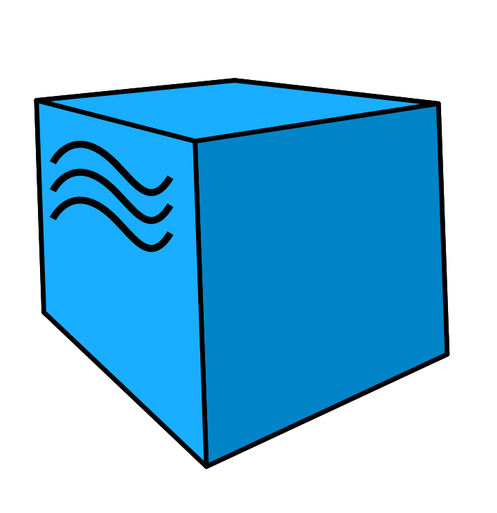

<h1 align="center">Проект автоматизации <a href="https://start.ru/">онлайн-кинотеатра</a> Start</h1>

#### Список проверок, реализованных в автотестах:
* ✅ Проверка кликабельности кнопки "Фильмы"
* ✅ Проверка кликабельности кнопки "Сериалы"
* ✅ Проверка кликабельности кнопки "Мультфильмы"
* ✅ Проверка кликабельности кнопки "Новинки"
* ✅ Проверка кликабельности кнопки "ТВ"
* ✅ Проверка работоспособности поиска
* ✅ Проверка возможности выбрать сериал с определенным жанром
* ✅ Проверка возможности выбрать сериал определенного года выпуска
* ✅ Проверка информации в разделе "Где смотреть"
* ✅ Проверка перехода на форму авторизации
* ✅ Проверка перехода на форму регистрации
#### API тесты:
* ✅ Проверка запуска трейлера
* ✅ Проверка работы поиска фильма
* ✅ Проверка возможности изменения языка в пользовательском соглашении
* ✅ Проверка переключения на детский режим
* ✅ Проверка перехода на раздел TV

Кейсы реализованы основе шаблона PageObject

## Используемый стек технологий и инструментов
|                          Python                                |                          Pytest                                |                              Selene                              |                          Selenoid                       |                       Allure                          |                            Git                             |                           Jenkins                              |                        Telegram                        |                         Allure TestOps                         |
|:--------------------------------------------------------------:|:--------------------------------------------------------------:|:----------------------------------------------------------------:|:-------------------------------------------------------:|:-----------------------------------------------------:|:----------------------------------------------------------:|:--------------------------------------------------------------:|:------------------------------------------------------:|:--------------------------------------------------------------:|
|||||||||  |

### Запуск автотестов выполняется на сервере Jenkins
> <a target="_blank" href="https://jenkins.autotests.cloud/test_qa_guru_python_17_diploma_work_Ops_and_notification_API(A_L)/">Ссылка на проект в Jenkins для запуска API тестов</a>
> 
> <a target="_blank" href="https://jenkins.autotests.cloud/test_qa_guru_python_17_diploma_work_Ops_and_notification_UI(A_L)/">Ссылка на проект в Jenkins для запуска UI тестов</a>

#### Для запуска автотестов в Jenkins

1. Открыть <a target="_blank" href="https://jenkins.autotests.cloud/test_qa_guru_python_17_diploma_work_Ops_and_notification_API(A_L)/">Проект в Jenkins для запуска API тестов</a> или <a target="_blank" href="https://jenkins.autotests.cloud/test_qa_guru_python_17_diploma_work_Ops_and_notification_UI(A_L)/">Проект в Jenkins для запуска UI тестов</a>
2. Выбрать пункт `Build with Parameters`
3. Выбрать окружение в выпадающем списке ENVIRONMENT
4. Выбрать браузер в BROWSER_NAME
5. Указать версию браузера в BROWSER_VERSION 
6. Нажать кнопку `Build`

### Тесты выполняются на удаленном браузере благодаря использованию Selenoid:
Логин и пароль для доступа к Selenoid хранятся в переменных среды
### Добавлена генерация отчетов на Allure:

----
### Allure-отчет

#### Общие результаты

#### Список тест-кейсов
